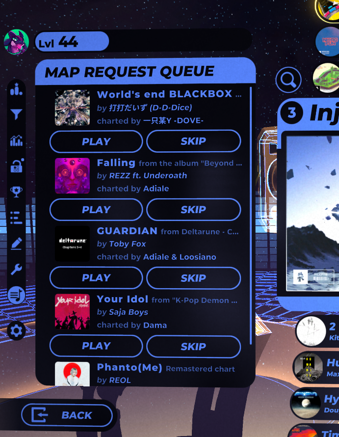

# SpinRequests
An in-game map request manager for Spin Rhythm XD that abstracts out functions to an HTTP GET API.

Any streaming bot you use (e.g. Streamer.bot, Firebot, MixItUp, etc.) now has request queue functionality -- so long as it supports making HTTP requests (at the minimum).



## Dependencies
- SpinCore
- SpinShareLib

# HTTP API
By default, a simple HTTP server is started on http://127.0.0.1:6969. Port and IP can be changed in the mod's JSON configuration file. A game restart is required for changes to take effect.

> [!CAUTION]
> It is **NOT RECOMMENDED** to let this listen on a public IP address. Unless you know what you're doing, stick to `localhost`/`127.x.x.x` IP ranges or any LAN IP range (`10.x.x.x`; `172.16.x.x - 172.31.x.x`; or `192.168.x.x`).

> [!CAUTION]
> If you are behind a firewall, it is **NOT RECOMMENDED** to forward the port you use for this HTTP server, unless you know what you are doing. Forwarding this means allowing anyone outside your local network will have full read/write access to your queue.

As this is really only a web server, you can test any of these endpoints in any web browser of your choice, while the game is running of course.

| Endpoint   | Description/Example                                                                                                                                                                                                                                                                                                                                                                                                                                                                                                                                                                                                                                                                                               | Returns                              |
|------------|-------------------------------------------------------------------------------------------------------------------------------------------------------------------------------------------------------------------------------------------------------------------------------------------------------------------------------------------------------------------------------------------------------------------------------------------------------------------------------------------------------------------------------------------------------------------------------------------------------------------------------------------------------------------------------------------------------------------|--------------------------------------|
| `/add`     | Adds a map to the queue.<br/>- User identifiers can be tacked on with a `user` query parameter. Internally this is set as a string, anything can be used so long as it's unique.<br/>- Service identifiers can be added by tacking on the `service` query parameter, useful if your requests come from multiple services.<br/>- Maps can be added regardless of queue status by appending the `force` query parameter with a `true` value.<br/>- HTTP response codes can be forced to 200 no matter the result to maintain compatibility with protocol-breaking software *(MixItUp)* by tacking on the `forceTwoHundred` query parameter with a `true` value.<br/>`/add/12345?user=TheBlackParrot&service=twitch` | [Map Data](#map-data-type)           |
| `/history` | Gets the session play history.<br/>- Response array length can be limited with a `limit` query parameter.<br/>- Responses can be limited to only charts exceeding the played threshold with a `onlyPlayed` query parameter set to `true`.<br/>`/history?limit=1`                                                                                                                                                                                                                                                                                                                                                                                                                                                  | Array([Map Data](#map-data-type))    |
| `/query`   | Queries SpinShare for basic map information.<br/>`/query/12345`                                                                                                                                                                                                                                                                                                                                                                                                                                                                                                                                                                                                                                                   | [Map Data](#map-data-type)           |
| `/queue`   | Gets the current request queue.<br/>- Requests from specific users can be obtained by using a `user` query parameter.<br/>`/queue?user=TheBlackParrot`                                                                                                                                                                                                                                                                                                                                                                                                                                                                                                                                                            | Array([Map Data](#map-data-type))    |

> [!NOTE]
> SpinShare supports map links using file reference codes, integer IDs are not needed. (e.g. `https://spinsha.re/song/spinshare_688b977c51882`)

# WebSocket API
By default, a WebSocket server is started on `http://127.0.0.1:6970`, acting as a firehose (meaning it just spits out information, no input is taken into account). Port and IP can be changed in the mod's configuration file. A game restart is required for changes to take effect.

> [!CAUTION]
> It is **NOT RECOMMENDED** to let this listen on a public IP address. Unless you know what you're doing, stick to `localhost`/`127.x.x.x` IP ranges or any LAN IP range (`10.x.x.x`; `172.16.x.x - 172.31.x.x`; or `192.168.x.x`).

**This is only used for events pertaining to the queue, and actions taken on the queue to avoid feature creep with other mods adding WebSocket support for other data.** You do not need to use this if you don't want to or can't use it.

<a name="websocket-events"></a>
## Events
You can use these events in any way you would like to -- the intentions here are listed to explain the intended use.

| Event             | Intention                       | Data object type           |
|-------------------|---------------------------------|----------------------------|
| `AddedToQueue`    | A map was added to the queue    | [Map Data](#map-data-type) |
| `Played`          | Playing a requested map         | [Map Data](#map-data-type) |
| `Skipped`         | Skipping a requested map        | [Map Data](#map-data-type) |
| `RequestsAllowed` | Requests are allowed/disallowed | Boolean                    |

All events follow the same data structure:
```json
{
  "Timestamp": <integer (unix timestamp in ms)>,
  "EventType": <string>,
  "Data": <dynamic (see table above)>
}
```

# Data structures/schema

<a name="map-data-type"></a>
## Map data
> [!CAUTION]
> Twitch viewers/users with the Moderator status do not have any AutoMod rulesets applied to them. If your bot is a moderator in your channel, responses that are made using any of these metadata fields will be allowed through verbatim.
```json
{
  "Title": <string>,
  "Subtitle": <string>,
  "Artist": <string>,
  "Mapper": <string>,
  "SpinShareKey": <integer>,
  "Requester": <string>,
  "Service": <string>,
  "EasyRating": <integer (nullable)>,
  "NormalRating": <integer (nullable)>,
  "HardRating": <integer (nullable)>,
  "ExpertRating": <integer (nullable)>,
  "XDRating": <integer (nullable)>,
  "RemiXDRating": <integer (nullable)>,
  "ActiveDifficulty": <string (nullable)>,
  "AlreadyDownloaded": <boolean>,
  "FileReference": <string (nullable)> (filename of the map data),
  "UploadTime": <integer (nullable)>,
  "UpdateTime": <integer (nullable)>,
  "HasPlayed": <boolean>,
  "InQueue": <boolean>
}
```
> [!NOTE]
> SpinShare does not respond with any data pertaining to the RemiXD difficulty (if present), this can only be generated using data from in-game.
> 
> *For the time being, this can only be set from the `/history` endpoint, otherwise it will always be null.*
 
---

**Project includes source files from [websocket-sharp](https://github.com/sta/websocket-sharp/tree/01a1a7559f21e38af1045a1ae1e8c123416b6df3), licensed under MIT**